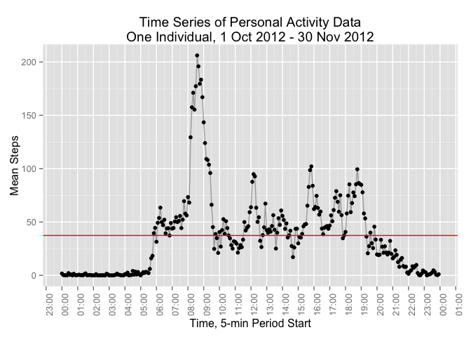

# Reproducible Research: Peer Assessment 1
Jack Gidding  
September 18, 2015  

## Introduction

It is now possible to collect a large amount of data about personal movement using activity monitoring devices such as a Fitbit, Nike Fuelband, or Jawbone Up. These type of devices are part of the “quantified self” movement – a group of enthusiasts who take measurements about themselves regularly to improve their health, to find patterns in their behavior, or because they are tech geeks. But these data remain under-utilized both because the raw data are hard to obtain and there is a lack of statistical methods and software for processing and interpreting the data.


## Loading and preprocessing the data

### Load

Load the libraries that will be used in the analysis. 


```r
library(reshape2)
library(plyr)
library(ggplot2)
library(lubridate)
library(scales)
```

Load the data from the csv file.


```r
data.activity <- read.csv("activity.csv")
```

The analyzed data is from a personal activity monitoring device of an 
anonymous individual. The data set contains the number of steps taken 
during five minute intervals throughout the day for a period of 
two months. Missing values from the device are represented by NA values.
Missing values may occur when the device was not on the individual or when the device was turned off. 

The columns in the data set are:

- steps: Number of steps taking in a 5-minute interval (missing values are coded as NA)

- date: The date on which the measurement was taken in YYYY-MM-DD format

- interval: Identifier for the 5-minute interval in which measurement was taken

There are 17,568 obvservations in the data set. 


```r
data.activity <- read.csv("activity.csv")
str(data.activity)
```

```
## 'data.frame':	17568 obs. of  3 variables:
##  $ steps   : int  NA NA NA NA NA NA NA NA NA NA ...
##  $ date    : Factor w/ 61 levels "2012-10-01","2012-10-02",..: 1 1 1 1 1 1 1 1 1 1 ...
##  $ interval: int  0 5 10 15 20 25 30 35 40 45 ...
```

### Process

The data is processed into a format suitable for analysis. 
During the processing phase, the data is modified as follows:

- Column 1 is converted to numeric
- Column 4 is added with POSIXct datetimes

Column 1 is modified so that mathematical operations (e.g. mean, sum) can 
be performed on the data. 

Column 4 is created to be suitable for charting.


```r
data.activity[,1] <-as.numeric(data.activity[,1])
data.activity[,4] <- parse_date_time(data.activity[,2], "y*!-m*!-d!")
data.activity[,4] <- parse_date_time(    
            sprintf("%d-%d-%d %d:%d:%d",
            year(data.activity[,4]), 
            month(data.activity[,4]), 
            day(data.activity[,4]),
            as.integer(data.activity[,3]/100),
            as.integer(data.activity[,3])-(as.integer(data.activity[,3]/100)*100),0),
         "y*!-m*!-d! H!:M!:S!"
)
names(data.activity)[4] <- "datetime"
```

The processed dataset is now in the format:


```r
str(data.activity)
```

```
## 'data.frame':	17568 obs. of  4 variables:
##  $ steps   : num  NA NA NA NA NA NA NA NA NA NA ...
##  $ date    : Factor w/ 61 levels "2012-10-01","2012-10-02",..: 1 1 1 1 1 1 1 1 1 1 ...
##  $ interval: int  0 5 10 15 20 25 30 35 40 45 ...
##  $ datetime: POSIXct, format: "2012-10-01 00:00:00" "2012-10-01 00:05:00" ...
```

```r
head(data.activity)
```

```
##   steps       date interval            datetime
## 1    NA 2012-10-01        0 2012-10-01 00:00:00
## 2    NA 2012-10-01        5 2012-10-01 00:05:00
## 3    NA 2012-10-01       10 2012-10-01 00:10:00
## 4    NA 2012-10-01       15 2012-10-01 00:15:00
## 5    NA 2012-10-01       20 2012-10-01 00:20:00
## 6    NA 2012-10-01       25 2012-10-01 00:25:00
```

A clean dataset, without NA values is also constructed for use in analyses.


```r
data.activity.clean <- data.activity[complete.cases(data.activity),]
str(data.activity.clean)
```

```
## 'data.frame':	15264 obs. of  4 variables:
##  $ steps   : num  0 0 0 0 0 0 0 0 0 0 ...
##  $ date    : Factor w/ 61 levels "2012-10-01","2012-10-02",..: 2 2 2 2 2 2 2 2 2 2 ...
##  $ interval: int  0 5 10 15 20 25 30 35 40 45 ...
##  $ datetime: POSIXct, format: "2012-10-02 00:00:00" "2012-10-02 00:05:00" ...
```

There are 15,264 observations in the clean dataset. A total of 2,304 observations with NA values were dropped from the original dataset.

## Analyzing the data

### What is mean total number of steps taken per day?

#### Total Steps per Day

The total number of steps per day is computed using the clean dataset. NA values do not add to the total.


```r
analysis.stepsPerDay <- ddply(data.activity.clean, .(date), summarize,
                              stepsPerDay = sum(steps))
head(analysis.stepsPerDay)
```

```
##         date stepsPerDay
## 1 2012-10-02         126
## 2 2012-10-03       11352
## 3 2012-10-04       12116
## 4 2012-10-05       13294
## 5 2012-10-06       15420
## 6 2012-10-07       11015
```

#### Histogram

A histogram of the daily activity is presented below. The bin sizes for the 
histogram were chosen as range/30 to display more granularity. 


```r
# Compute the histogram bin width
bins = max(analysis.stepsPerDay$stepsPerDay)/30

# Display the histogram
ggplot(analysis.stepsPerDay, aes(analysis.stepsPerDay$stepsPerDay)) + 
    geom_histogram(binwidth=bins, aes(fill = ..count..), col="black") +
    labs(x="Steps per Day", y="Frequency") +
    labs(title="Histogram of Personal Activity Data\nOne Individual, 1 Oct 2012 - 30 Nov 2012")
```

 


#### Mean and Median Steps per Day

The mean and median were calculated using the summarized dataset based
on the clean dataset with no NA values.


```r
analysis.meanSteps <- mean(analysis.stepsPerDay$stepsPerDay)
analysis.medianSteps <- median(analysis.stepsPerDay$stepsPerDay)
```
The mean number of steps per day is 10,766 and the median number of steps per day is 10,765


### What is the average daily activity pattern?

#### Time Series Plot


A time series plot of the 5-minute interval versus mean number of steps per
day was constructed. This shows the individual's typical activity level during
the day. 


```r
analysis.stepsPerInterval <- ddply(data.activity.clean, .(interval), summarize,
                              meanStepsPerInterval = mean(steps))
analysis.stepsPerInterval[,3] <- data.activity$datetime[1:288]
names(analysis.stepsPerInterval)[3] <- "datetime"
```

There are 288 5-minute intervals during a day. Each interval is represented by a point on the following time series plot.


```r
ggplot(data=analysis.stepsPerInterval, aes(x=datetime, y=meanStepsPerInterval,group=1)) +  
    geom_line(color="dark grey") +
    geom_point() +
    xlab("Time, 5-min Period Start") + ylab("Mean Steps") + 
    geom_hline(yintercept=mean(data.activity.clean$steps),col="red") +
    theme(axis.text.x = element_text(angle = 90, hjust = 1)) +
    scale_x_datetime(breaks = date_breaks("1 hour"),
                     labels = date_format("%H:%M")) +
    labs(title="Time Series of Personal Activity Data\nOne Individual, 1 Oct 2012 - 30 Nov 2012") 
```

 

The red line on the time series plot shows the mean number of steps per 5-minute interval, which is 
37 steps. 

From the data, it appears that the subject likely sleeps from 10:30 PM to approximately 5:30 AM.

#### Largest Interval

The interval with the largest amount of activity was computed by summing the steps in each period for all days. 


```r
# Calculate the sum of steps each day
analysis.stepsPerDay <- ddply(data.activity.clean, .(interval), summarize,
                              totalSteps = sum(steps))

# Find the max interval as an integer number (e.g. 1045) in the dataset
analysis.maxInterval <- analysis.stepsPerDay[analysis.stepsPerDay$totalSteps ==
                                        max(analysis.stepsPerDay$totalSteps), ]

# Compute the period of the max interval
if (analysis.maxInterval$interval<1200) { iPeriod <- "AM"} else {iPeriod <- "PM"}

# Create the formatted time string of the max interval
formattedInterval <- sprintf("%d:%d %s",
            as.integer(analysis.maxInterval$interval/100),
            as.integer(analysis.maxInterval$interval)-(as.integer(analysis.maxInterval$interval/100)*100),
            iPeriod)
```

Then period with the max number of steps is 8:35 AM. This is consistent with the data displayed in the time series chart above.

### Inputing missing values

There are a number of days/intervals where there are missing values (coded as NA). The presence of missing days may introduce bias into some calculations or summaries of the data.

#### Total number of missing values

There are 2,304 observations with missing values in the initial dataset. 

```r
NROW(data.activity[is.na(data.activity[,1]),])
```

```
## [1] 2304
```

#### Filling in missing values

A strategy was devised for filling in missing values. The NA values are filled in with the mean steps per day in order to not throw off the mean of the overall sample. This could be more sophisticated (e.g. mean value of the steps for the specific day). But, the assignment did not require the more sophisticated algorithm.  


```r
# Create the new dataset. NAs will be replaced
data.complete <- data.activity

# Determine the value that will replace NA values
replacement <- mean(data.activity.clean$steps)

# Loop through the dataset and replace all NA values with the mean
for (i in seq(from=1, to=nrow(data.complete))) {
    if (is.na(data.complete$steps[i])) {
        data.complete$steps[i] <- replacement
     }
}
```

To confirm, the new dataset now has 0 observations with missing values. 


```r
NROW(data.activity[is.na(data.complete[,1]),])
```

```
## [1] 0
```

#### Dataset with missing values filled in

A new dataset was created (above) that is equal to the original dataset but with the missing data filled in. The new dataset can be compared to data.activity, shown previously in the Process section of this report, to compare the filled in NA values.


```r
head(data.complete)
```

```
##     steps       date interval            datetime
## 1 37.3826 2012-10-01        0 2012-10-01 00:00:00
## 2 37.3826 2012-10-01        5 2012-10-01 00:05:00
## 3 37.3826 2012-10-01       10 2012-10-01 00:10:00
## 4 37.3826 2012-10-01       15 2012-10-01 00:15:00
## 5 37.3826 2012-10-01       20 2012-10-01 00:20:00
## 6 37.3826 2012-10-01       25 2012-10-01 00:25:00
```

#### Histogram

A histogram of the dataset without missing values was created. The historgram is of the total number of steps taken each day. The same histogram bin width was used as in the previous historgram.


```r
# Calculate the sum of steps each day
analysis.stepsPerDay2 <- ddply(data.complete, .(date), summarize,
                              stepsPerDay = sum(steps))

# Compute the histogram bin width
bins = max(analysis.stepsPerDay2$steps)/30

# Display the histogram
ggplot(analysis.stepsPerDay2, aes(analysis.stepsPerDay2$steps)) + 
    geom_histogram(binwidth=bins, aes(fill = ..count..), col="black") +
    labs(x="Steps per Day", y="Frequency") +
    labs(title="Histogram of Personal Activity Data\nOne Individual, 1 Oct 2012 - 30 Nov 2012")
```

 

The histogram looks like the one presented in the previous section of this
report. 

Next, the mean and media of the completed dataset are computed.


```r
analysis.meanSteps <- mean(analysis.stepsPerDay2$stepsPerDay)
analysis.medianSteps <- median(analysis.stepsPerDay2$stepsPerDay)
```
The mean number of steps per day is 10,766 and the median number of steps per day is 10,766. The mean is the same as the cleaned dataset and the median has increased by 1. This is not significantly different. Thus the characteristics of the cleaned dataset (above) have been preserved when the NA values were replaced with the mean number of steps per day. The missing values therefore do not have a big impact on the analysis.

### Are there differences in activity patterns between weekdays and weekends?

#### Identifying weekend days and weekdays

A new factor variable was created in the complete dataset with two levels – “Weekday” and “Weekend” indicating whether a given date is a weekday or weekend day. The weekdays begin with a 1 (Sunday) and count up to 7 (Saturday).


```r
# Loop through the dataset to assign weekday/end
for (i in seq(from=1, to=nrow(data.complete))) {
        theday <- wday(data.complete[i,4])
        if (theday > 1 & theday<7) {
            data.complete[i,5] <- "Weekday"
        } else {
            data.complete[i,5] <- "Weekend"
        }
}
# Name the column and turn it into a factor
names(data.complete)[5] <- "daytype"
data.complete$daytype <- as.factor(data.complete$daytype)
```

The resulting dataset with the new daytype factor variable looks like:


```r
head(data.complete)
```

```
##     steps       date interval            datetime daytype
## 1 37.3826 2012-10-01        0 2012-10-01 00:00:00 Weekday
## 2 37.3826 2012-10-01        5 2012-10-01 00:05:00 Weekday
## 3 37.3826 2012-10-01       10 2012-10-01 00:10:00 Weekday
## 4 37.3826 2012-10-01       15 2012-10-01 00:15:00 Weekday
## 5 37.3826 2012-10-01       20 2012-10-01 00:20:00 Weekday
## 6 37.3826 2012-10-01       25 2012-10-01 00:25:00 Weekday
```

#### Time series Plot

The data was gathered by number of steps per inteval for the two types of days. The datetime column was added for use by charting. 


```r
data.complete.agg <- aggregate(steps ~ interval + daytype, data.complete, mean, na.action = na.omit)
data.complete.agg[,4] <- data.activity$datetime[1:288]
names(data.complete.agg)[4] <- "datetime"
```

The resulting data.frame looks like:


```r
head(data.complete.agg)
```

```
##   interval daytype    steps            datetime
## 1        0 Weekday 7.006569 2012-10-01 00:00:00
## 2        5 Weekday 5.384347 2012-10-01 00:05:00
## 3       10 Weekday 5.139902 2012-10-01 00:10:00
## 4       15 Weekday 5.162124 2012-10-01 00:15:00
## 5       20 Weekday 5.073235 2012-10-01 00:20:00
## 6       25 Weekday 6.295458 2012-10-01 00:25:00
```

A panel plot was constructed that contains a time series plot of the 5-minute interval versus the average number of steps taken, averaged and displayed by type of day. This is similar to the plot above, with the addition of the facet_wrap. 


```r
ggplot(data=data.complete.agg, aes(x=datetime, y=steps,group=1)) +  
    geom_line(color="dark grey") +
    geom_point() +
    facet_wrap(~ daytype, nrow=2, ncol=1) +
    xlab("Time, 5-min Period Start") + ylab("Mean Steps") + 
    geom_hline(yintercept=mean(data.activity.clean$steps),col="red") +
    theme(axis.text.x = element_text(angle = 90, hjust = 1)) +
    scale_x_datetime(breaks = date_breaks("1 hour"),
                     labels = date_format("%H:%M")) +
    labs(title="Time Series of Personal Activity Data\nOne Individual, 1 Oct 2012 - 30 Nov 2012")
```

 

The red line on the charts shows the mean number of steps per 5-minute interval across all days and time intervals. The mean is 37 steps. 

We can see that the weekend activity appears to be higher than the mean. We can conclude that the subject appears to be more active during the weekend days. Due to the lower activity in the early morning hours on the weekend, we can hypothesize that the subject sleeps about 90 minutes longer on weekend days. 
